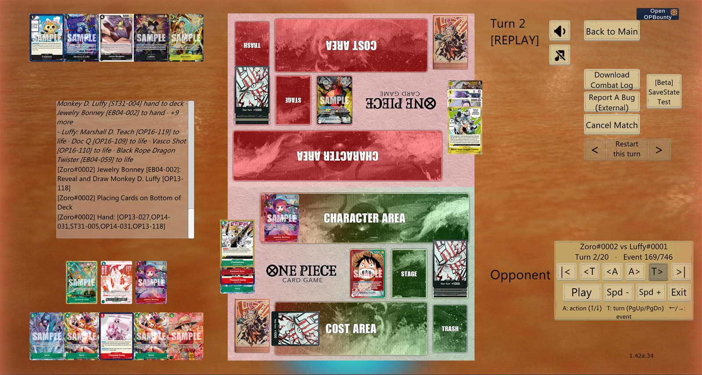
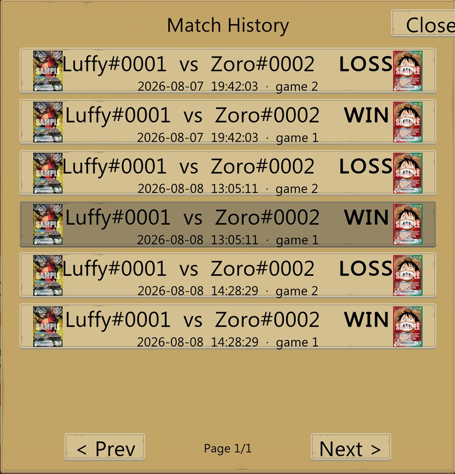
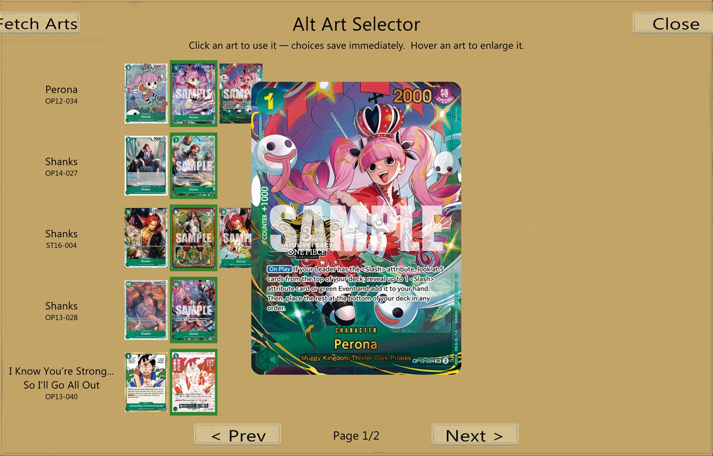
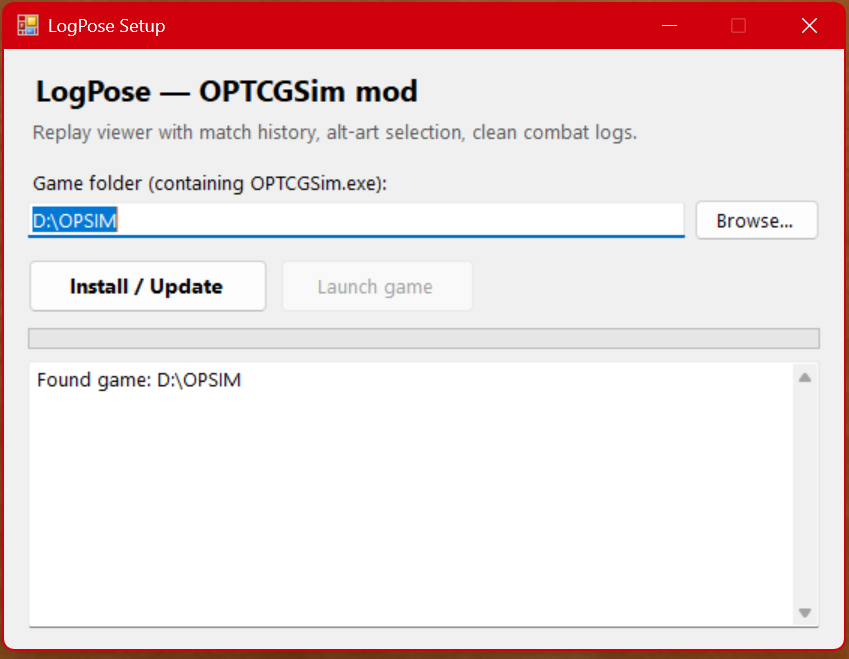

# LogPose — OPTCGSim mod

BepInEx plugin for OPTCGSim (v1.42a, Unity 6, Mono) adding a full in-game replay viewer with
match history, combat-log fixes, complete replay (RZ1) output, and per-deck alternate card art
selection. Game install: `D:\OPSIM`.

<p align="center"></p>
<p align="center"><i>A recorded match playing back on the real board — the reveal row shows exactly what a searcher looked at, the combat log follows along, and your alt-art picks apply.</i></p>

## Layout

| Path | What |
|------|------|
| `LogPose/` | Plugin source (C#, netstandard2.1, Harmony patches) |
| `analysis/log-coverage-and-don-analysis.md` | Reverse-engineered RZ1 replay format + all logging gaps (DON!! focus) |
| `tools/Fetch-AltArts.ps1` | Downloads official parallel-art images + makes `_small` thumbnails |
| `decompiled/` | ilspycmd output of the game's `Assembly-CSharp.dll` (local only — gitignored, not redistributable) |

## Features

**Replay stream completeness** (`ReplaySyncPatches.cs`) — the base game never emits RZ1 lines for
the refresh-phase untap (leader/characters/stage/**cost-area DON**), attacker rest, blocker rest,
or manual/effect tap-untap. The plugin re-publishes affected cards through the game's own
`ReplaySync_EmitCurrentZoneState`, so replayers (OPTCGReplay) finally see correct DON!! and rest
states. Config: `EmitMissingReplayLines`.

**Clean combat logs** (`CombatLogPatches.cs`) — alongside each autosaved log the plugin writes
`<stamp>.clean.log` (markup + zero-width chars stripped, UTF-8, human lines only) and
`<stamp>.rz1` (replay lines only). Config: `WriteCleanLog`, `WriteReplayFile`, `LogFontSize`.

**Match History** (`Replay/MatchHistoryUI.cs`) — a native-styled button on the main menu opens a
browser of every recorded game: your leader left, the opponent's right, colored WIN/LOSS
(detected from log lines, falling back to final life totals for lethal endings), date and game
number. Clicking a match auto-starts a board behind a loading cover and drops you straight into
that replay — this is the intended way in.

<p align="center"></p>

**In-game replay viewer** (`Replay/*.cs`) — plays any recorded `.rz1` back on the real game
board using the game's own card objects, so moves glide instead of teleporting and the whole
thing reads as a built-in feature.

- *Transport*: a native-styled panel (bottom right) with first/last, turn, action, and event
  stepping plus autoplay with speed control. Keyboard: `←/→` events, `↑/↓` actions,
  `PgUp/PgDn` turns, `Home/End`. "Actions" are the game's own log-line boundaries, so one step
  is one meaningful thing happening.
- *Synced combat log*: the side log panel replays in lockstep with the board, sticky-scrolled
  to the latest line, and adds synthetic narration for deck activity the vanilla log never
  describes (searches, mills, scries — with real card names, including the opponent's).
- *Search X-ray*: when a searcher resolves, every card that was looked at appears in a reveal
  row by the searching player's deck — the card being taken sits raised, then flies to hand
  while the rest bottom-deck. Duplicate copies each get their own slot, and clusters never mix
  the two players' deck activity.
- *Correctness*: reconstruction is validated against the CHK checksums embedded in the stream
  and the accuracy is shown in the panel (100% on well-formed LogPose recordings). Rest states
  (leader, characters, stage, cost-area DON, attached DON) render faithfully. One autosave can
  contain several games (rematches); the parser splits them via checksum signatures and lists
  each game separately. Recordings that lack the vanilla `.log` still get a synced combat log —
  line positions are reconstructed by anchoring narration against the move stream.
- *Getting in and out*: Match History is the front door; **F7** (file picker) and **F8** (open
  newest instantly) also work from a Solo v Self board. Exit with the panel's Exit button or
  just leave via Back to Main — the viewer tears itself down either way.

**Chess-clock match timer** (`GameTimer.cs`) — enable `[Timer]` in the config and every game
gets per-player time banks (default 5 minutes, optional Fischer increment per turn) shown in
a native panel by the turn counter: your clock ticks on your turn, the active side is
highlighted, low time turns red. When *your* bank empties in multiplayer, LogPose concedes
for you through the game's normal concede — so with both players running the same settings
it behaves like a real chess clock, each side enforcing its own flag. The panel displays the
configured time so a settings mismatch is visible at a glance.

**Alt art selector** (`AltArt*.cs`) — click **Alt Arts** in the deck editor (or press **F6**).
A native-styled page lists every deck card that has variant art with all of its arts as
thumbnails — base first, the active pick highlighted. Click an art to use it (saved to the
sidecar immediately), hover to enlarge. Choices live in `Decks\<name>.deck.arts.json` (the
`.deck` file is untouched, so decks stay vanilla-compatible) and apply in-game for the deck
you play — and in replays. Art files are looked up as `Cards\<SET>\<ID>_p1.png` / `_alt1.png`
(+ optional `_p1_small.jpg` thumbnail).

<p align="center"></p>

Note: art is client-side — opponents see their own local art, not your selection.

**Hold Shift while hovering** a card with a selected variant and the enlarged preview shows
the base (original English) card instead — handy when a parallel has Japanese text and you
want to read what it does. Release Shift and the variant art is back. Works in gameplay, the
deck editor, and replays.

## Install

**Easiest — GUI installer**:

<p align="center"></p>

1. Download `LogPoseSetup.exe` from the [latest release](https://github.com/HVallad/LogPose/releases).
2. Run it. Windows SmartScreen may warn about an unknown publisher the first time — click
   *More info → Run anyway* (it's this repo's unsigned open-source tool; `LogPoseSetup/` has
   the full source).
3. It auto-detects the game folder in common spots — otherwise click *Browse…* and pick your
   `OPTCGSim.exe` (pasting the exe path works too).
4. Click **Install / Update**. It fetches BepInEx (if needed) and the newest LogPose, then
   offers to launch the game.

Re-run it anytime to update — though after the first install the mod updates itself: when a
new version exists, an update button appears at the top left of the game's main menu.

Or, one command in PowerShell — installs BepInEx if it's missing and the latest LogPose release
(auto-detects the game folder, or asks; re-run it anytime to update):

```
irm https://raw.githubusercontent.com/HVallad/LogPose/main/install.ps1 | iex
```

From a downloaded copy of [install.ps1](install.ps1) you can also pass the folder explicitly,
or uninstall:

```
powershell -ExecutionPolicy Bypass -File install.ps1 -GamePath "C:\path\to\OPTCGSim"
powershell -ExecutionPolicy Bypass -File install.ps1 -Uninstall
```

Manual alternative: grab `LogPose.dll` from the
[latest release](https://github.com/HVallad/LogPose/releases) and drop it into
`<game>\BepInEx\plugins\`, with [BepInEx 5.4.23+ win-x64](https://github.com/BepInEx/BepInEx/releases)
extracted into the game folder first (`winhttp.dll` + `BepInEx\` next to `OPTCGSim.exe`).
Config appears at `BepInEx\config\com.hunter.logpose.cfg` after first run.

## Build from source

```
dotnet build LogPose/LogPose.csproj -c Release
copy LogPose\bin\Release\LogPose.dll D:\OPSIM\BepInEx\plugins\
```

The csproj references game assemblies from `D:\OPSIM\OPTCGSim_Data\Managed` and BepInEx from
`D:\OPSIM\BepInEx\core` — adjust paths if your install differs.

## Fetching more alt arts

The easy way: open the Alt Art Selector on a deck and click **Fetch Arts** — the mod probes
the official card sites for every card in that deck (EN first, JP fallback), generates
thumbnails, and the rows fill in live. Takes ~20 seconds for a typical deck.

For whole sets at once, use the script:

```
powershell -ExecutionPolicy Bypass -File tools\Fetch-AltArts.ps1 -Sets OP02,OP03
powershell -ExecutionPolicy Bypass -File tools\Fetch-AltArts.ps1 -All
```

Images come from the official EN card database (`en.onepiece-cardgame.com`), personal use.
Re-running skips existing files. If a game update replaces `Assembly-CSharp.dll`, rebuild the
plugin (and re-run ilspycmd if you want fresh decompiled sources); if a patch renames one of the
patched methods the corresponding Harmony patch will log an error on startup and only that
feature degrades.
